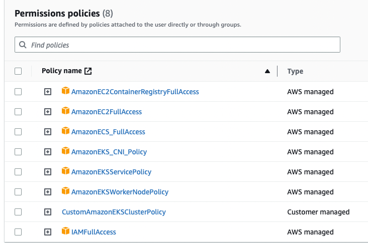

# Mini Flask Monitoring app on EKS

Flask based monitoring application & containerized it using Dockerfile. Created
Kubernetes Deployments & Service YAMLs using the image on ECR & hosted it on EKS cluster

1. create requirements.txt
2. pip3 install --no-cache-dir -r requirements.txt (To install all dependencies)
3. Create index.html in templates
4. Create app.py with set api routes and rendering on frontend
5. Run and test it locally python3 app.py
6. Create Dockerfile
7. Build docker image - docker build -t my-flask-app:v1 .
8. run docker image and publish port - docker run -d -p 5010:5010 --name FlaskAppContainer my-flask-app:v1
9. to attach a shell to a running container - docker container exec -it FlaskAppContainer bash

## To clear running container:

- docker stop FlaskAppContainer
- to restart a stopped container - docker start FlaskAppContainer
- to remove a container that was created - docker rm FlaskAppContainer
- to remove the image that was used to create the container - docker rmi my-flask-app:v1

## AWS CLI

- aws configure (ren it and provide access tokens for python boto3 module to make changes)
- aws iam list-users
- create a user with the following permissions
  

- The custom policy has rules for managing EKS clusters like "eks:\*"
- Create service roles for the cluster and the node separately using the root user

## Create a repository in ECR using python boto3 in ecr.py

- import the boto3 module
- set the ecr client
- call the create_repository method
- run the ecr.py using pyhon3 ecr.py
- print the uri from the response - 910099015354.dkr.ecr.us-east-1.amazonaws.com/flask_monitoring_app_repo

## Push local docker image into ECR repository flask_monitoring_app_repo

- aws ecr get-login-password --region us-east-1 | docker login --username AWS --password-stdin 910099015354.dkr.ecr.us-east-1.amazonaws.com
- docker build -t flask_monitoring_app_repo .
- docker tag flask_monitoring_app_repo:latest 910099015354.dkr.ecr.us-east-1.amazonaws.com/flask_monitoring_app_repo:latest
- docker push 910099015354.dkr.ecr.us-east-1.amazonaws.com/flask_monitoring_app_repo:latest

## Create EKS cluster on AWS with the new user that was created

- after cluster becomes active, create a node group with 2 nodes using t2.micro

## Create Kubernetes deployment and service on VS code using boto3 python

- Update the local kubernetes config file with the eks cluster using this command - aws eks update-kubeconfig --name clustername
- Set the context to use the eks cluster context using kubectx
- create eks.py and define deployments and the service and provide the uri to the image in ecr
- pyhton3 eks.py
- check if deployment is created - kubectl get deployments -n default, kubectl get svc -n default, kubectl get pods -w, kubectl describe pods monitoring-flask-app-74c846c996-fgrhb -n default
- port forward to your localmachine using the following command - kubectl port-forward svc/monitoring-flask-service 5010:5010
- Now go to localhost:5010 on your host browser to check if the app is running

## Debugging commands

- docker inspect --format '{{.Architecture}}' my-flask-image:v1
- kubectl logs monitoring-flask-app-74c846c996-fgrhb
